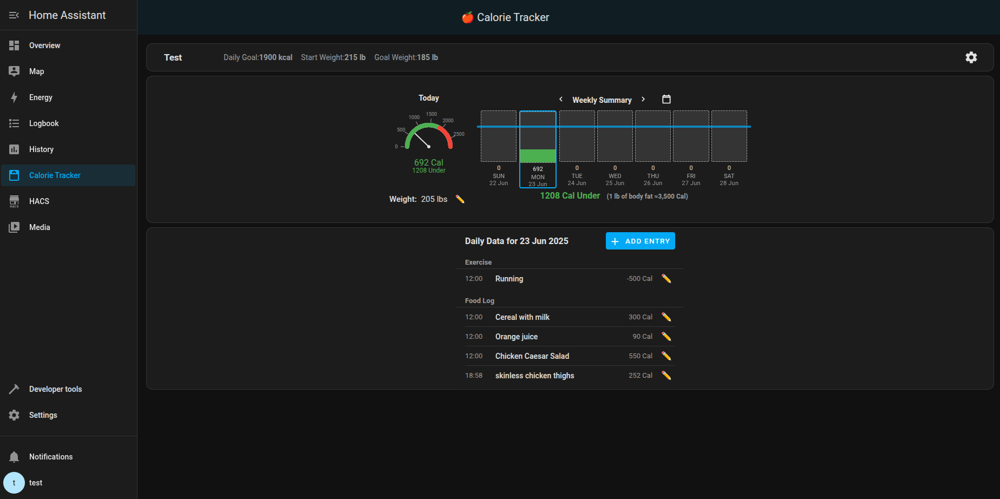
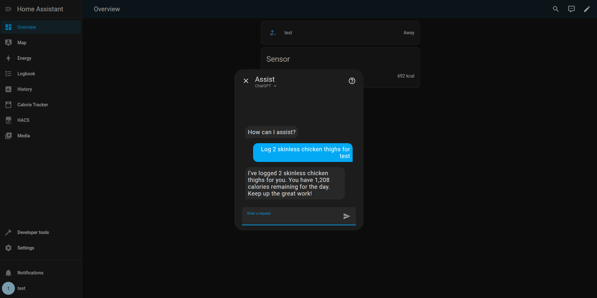

# Home Assistant Calorie Tracker

The Calorie Tracker is a custom component for Home Assistant that helps you monitor your daily calorie intake and progress toward your fitness goals. If using an LLM conversation agent (such as OpenAI Conversation), you can log everything through your voice assistant. A custom panel is included for visualizing your progress. 

## Features

- Log calories, exercises, and daily weight.
- Set your starting weight, goal weight, and daily calorie goals.
- View progress in a custom panel within Home Assistant.
- Supports multiple profiles for different users.
- With an LLM conversation agent (such as OpenAI Conversation) you can:
    - Log calories, exercise, and weight with your voice assistant
    - If you don't know the calories, the LLM will estimate them from the description (better datails for better estimate)

## Installation

1. Clone or download this repository into your Home Assistant `custom_components` directory:
   ```bash
   git clone https://github.com/kgstorm/home-assistant-calorie-tracker.git
   ```
Ensure the folder structure looks like this:
   ```yaml
    custom_components/
        calorie_tracker/
            __init__.py
            api.py
            const.py
            storage.py
            websockets.py
            ...
   ```
Restart Home Assistant.

Add the Calorie Tracker integration via the Home Assistant UI:

Navigate to Settings > Integrations.
Click Add Integration and search for "Calorie Tracker".
Once setup, a Calorie Tracker panel will appear in the Home Assistant sidebar. Entries can he made/edited/deleted in the sidebar.

A service call is also available to log calories.

## Screenshots

### Calorie Tracker Panel


### LLM Example


Development
Contributions are welcome! Please open an issue or submit a pull request if you'd like to improve the component.
