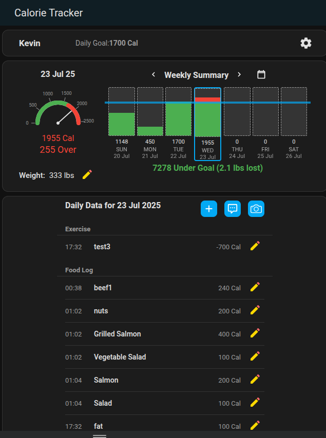
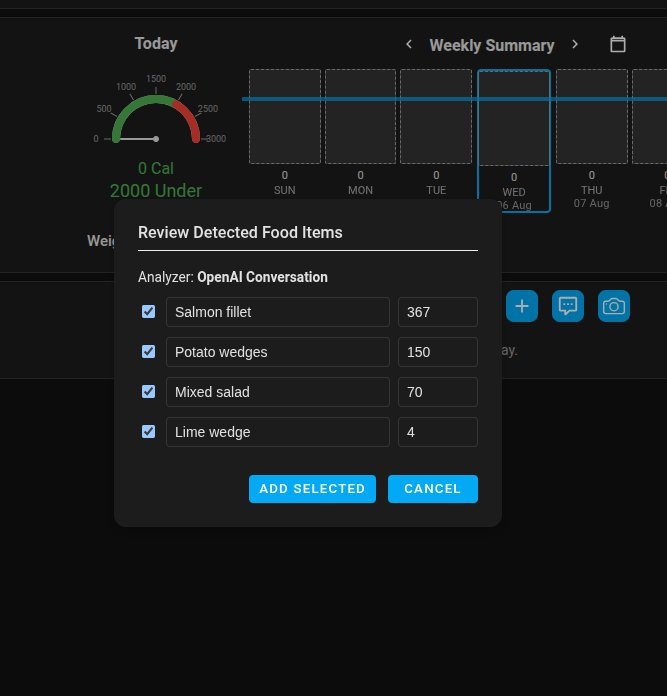

# Home Assistant Calorie Tracker

[](https://hacs.xyz/)

[](https://www.buymeacoffee.com/t8hdahudm6)

A [HACS](https://www.hacs.xyz/) integration that helps you monitor your daily calorie intake and progress toward your fitness goals. If using an LLM conversation agent (such as OpenAI Conversation), you can log everything through your voice assistant. A custom panel is included for visualizing your progress.

## Push for Home Assist Voice Preview Edition

I built this integration after purchasing a [Home Assistant Voice Preview Edition](https://www.home-assistant.io/voice-pe/). This device (combined with an LLM as a conversation agent) has been a game changer for using a voice assistant without getting frustrated. This thing actually works. Being able to quickly speak to this voice assistant to log calories, exercise, and weights without having to look at my phone makes all the difference. Not to mention the LLM pretty accurately estimates calories if you don't know them. It's awesome.


## Features

- Tracks calories, exercise, weight, and body fat.
- Set your starting weight, goal weight, and daily calorie goals.
- Includes a Home Assistant side panel to view/edit all data.
- Supports multiple profiles for different users.
- With an LLM conversation agent you can:
    - Log calories, exercises, daily weight, and body fat with your voice assistant
    - The LLM can also estimate calories from descriptions (better datails for better estimate)
    - Log calories by taking a picture of food (LLM must support image inputs)
    - Ask the LLM how many calories you have remaining for the day.
- Service calls are available to log food, exercise, weight, body fat, and to fetch data.
- Calculates estimated weekly weight loss/gain.

## Log Calories/Body Fat by Taking a Photo (LLM required)

- Logging calories and body fat percent via photos is supported with these conversation agents (an LLM that accepts image inputs is required):
    - [Anthropic](https://www.home-assistant.io/integrations/anthropic)
    - [Azure OpenAI Conversation](https://github.com/joselcaguilar/azure-openai-ha)
    - [Google Generative AI Conversation](https://www.home-assistant.io/integrations/google_generative_ai_conversation)
    - [Ollama](https://www.home-assistant.io/integrations/ollama)
    - [OpenAI Conversation](https://www.home-assistant.io/integrations/openai_conversation)

## Auto logging Peloton workouts

- The Calorie Tracker integration will detect if there is a [Home Assistant Peloton Sensor](https://github.com/edwork/homeassistant-peloton-sensor) profile and allow you to link the Peloton profile to a Calorie Tracker profile. Peloton workouts will then be auto logged.
- If you have other components you would like to log automatically, submit an [issue](https://github.com/kgstorm/home-assistant-calorie-tracker/issues).

## Install with HACS

The recommended way to download this is via HACS:

[](https://my.home-assistant.io/redirect/hacs_repository/?category=custom_respository&owner=kgstorm&repository=home-assistant-calorie-tracker)

Restart Home Assistant.

Add the Calorie Tracker integration via the Home Assistant Settings > Integrations.

## Manual Installation

Clone or download this repository into your Home Assistant `custom_components` directory:
   ```bash
   git clone https://github.com/kgstorm/home-assistant-calorie-tracker.git
   ```

Ensure the folder structure looks like this:
   ```yaml
    custom_components/
        calorie_tracker/
            __init__.py
            api.py
            const.py
            storage.py
            websockets.py
            ...
   ```
Restart Home Assistant.

Add the Calorie Tracker integration via the Home Assistant Settings > Integrations.

## Screenshots

### Calorie Tracker Panel
Entries can be viewed/made/edited/deleted in the Calorie Tracker panel:




### LLM Chat/Voice Example


### LLM Photo Example




### Service Calls

Service calls are provided for automating food, exercise, and weight entries.
You can use these services in Home Assistant automations, scripts, or via the Developer Tools > Services UI.

**Available services:**
- `calorie_tracker.log_food`
- `calorie_tracker.log_exercise`
- `calorie_tracker.log_weight`
- `calorie_tracker.log_body_fat`
- `calorie_tracker.fetch_data`

**Example usage in YAML:**
```yaml
service: calorie_tracker.log_weight
data:
  spoken_name: "Test"
  weight: 195
  timestamp: "2025-08-04T14:30"
```
```yaml
action: calorie_tracker.fetch_data
data:
  spoken_name: Jimbo
  timestamp: "2025-08-12"

RESPONSE:

user: Jimbo
date: "2025-08-12"
food_entries:
  - id: a5dfffc72b1e422e95454bbc727ec353
    timestamp: 2025-08-12T10:23
    food_item: Salmon
    calories: 300
  - id: adb689bb5cd8406088bf80752df01a02
    timestamp: 2025-08-12T10:23
    food_item: Potato wedges
    calories: 250
  - id: a41ec6f689fe4a6a9d355f601fad917c
    timestamp: 2025-08-12T10:23
    food_item: Salad
    calories: 100
exercise_entries:
  - id: c6241119f1c148a1a64c2c02bb0ec39f
    timestamp: 2025-08-12T01:32
    exercise_type: Jog
    duration_minutes: 30
    calories_burned: 300
weight: 180
body_fat_pct: 25
bmr: 1692.7
```
Note: For fetching data, the latest recorded weight and body fat (prior to the date requested) are returned, which are also the values used to calculate BMR.
See the Developer Tools in Home Assistant for full details and examples.


### Dashboard Cards

In addition to the built-in side panel, you can add Calorie Tracker cards to any Home Assistant dashboard.

#### Setup Dashboard Cards

1. **Add the frontend resource** (required for cards to work):
   - Go to **Settings** > **Dashboards** > **Menu (3 dots)** > **Resources**
   - Click **Add Resource**
   - Add this URL: `/calorie_tracker_frontend/cards.js`
   - Set Resource Type to **JavaScript Module**

2. **Add cards to your dashboard**:
   Switch to edit mode on any dashboard and add a manual card with the following configurations:

**Summary Card:**
```yaml
type: custom:calorie-summary-card
profile_entity_id: sensor.calorie_tracker_<Users spoken name at entity creation>
title: "Jason's Calorie Summary" (Optional)
```

**Daily Log Card:**
```yaml
type: custom:calorie-daily-log-card
profile_entity_id: sensor.calorie_tracker_<Users spoken name at entity creation>
title: "Shawn's Calorie Log" (Optional)
```

**Profile Card:**
```yaml
type: custom:calorie-profile-card
profile_entity_id: sensor.calorie_tracker_<Users spoken name at entity creation>
title: "Janet's Calorie Profile" (Optional)
```

**Today's Calories (Gauge Only):**
```yaml
type: custom:calorie-gauge-card
profile_entity_id: sensor.calorie_tracker_<Users spoken name at entity creation>
max_height: "250px" (Optional to set size of gauge)
title: "Elenor's Calories" (Optional)
```

These cards provide the same functionality as the side panel but can be placed anywhere on your dashboards for quick access. 


### Development
Contributions are welcome. Please open an [issue](https://github.com/kgstorm/home-assistant-calorie-tracker/issues) or submit a pull request if you'd like to improve the component.

