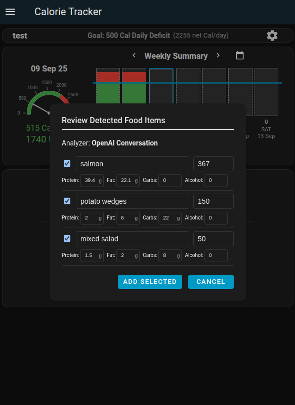

# Home Assistant Calorie Tracker

[](https://hacs.xyz/)

[](https://www.buymeacoffee.com/t8hdahudm6)

A [HACS](https://www.hacs.xyz/) integration that helps you monitor your daily calorie intake and progress toward your fitness goals. If using an LLM conversation agent (such as OpenAI Conversation), you can log everything through your voice assistant. A custom panel is included for visualizing your progress.

## Push for Home Assist Voice Preview Edition

I built this integration after purchasing a [Home Assistant Voice Preview Edition](https://www.home-assistant.io/voice-pe/). This device (combined with an LLM as a conversation agent) has been a game changer for using a voice assistant without getting frustrated. This thing actually works. Being able to quickly speak to this voice assistant to log calories, exercise, and weights without having to look at my phone makes all the difference. Not to mention the LLM pretty accurately estimates calories if you don't know them. It's awesome.


## Features

- Tracks calories, exercise, weight, body fat, and macronutrients.
- Set your starting weight, goal weight, and daily calorie goals.
- Includes a Home Assistant side panel to view/edit all data.
- Supports multiple profiles for different users.
- With an LLM conversation agent you can:
    - Log calories, exercises, daily weight, and body fat with your voice assistant
    - The LLM can also estimate calories and macros from descriptions (better details for better estimates)
    - Log calories and macros by taking a picture of food (LLM must support image inputs)
    - Ask the LLM how many calories you have remaining for the day.
    - Ask the LLM for your macro breakdown.
- Service calls are available to log food, exercise, weight, body fat, and to fetch data.
- Calculates estimated weekly weight loss/gain.

## Log Calories/Body Fat by Taking a Photo (LLM required)

- Logging calories and body fat percent via photos is supported with these conversation agents (an LLM that accepts image inputs is required):
    - [Anthropic](https://www.home-assistant.io/integrations/anthropic)
    - [Azure OpenAI Conversation](https://github.com/joselcaguilar/azure-openai-ha)
    - [Google Generative AI Conversation](https://www.home-assistant.io/integrations/google_generative_ai_conversation)
    - [Ollama](https://www.home-assistant.io/integrations/ollama)
    - [OpenAI Conversation](https://www.home-assistant.io/integrations/openai_conversation)

## Macronutrient Tracking

- Track protein, carbohydrates, fat, and alcohol intake alongside calories.
- View macro percentages in the daily log and dedicated macro cards.
- Visual gauge cards for each macronutrient with customizable min/max targets.
- Pie chart visualization showing macro distribution as percentage of total calories.
- Automatic calculation of calories from macros (4 cal/g protein & carbs, 9 cal/g fat, 7 cal/g alcohol).

## Calorie Goal Types

The integration supports multiple goal types to fit different approaches to calorie management:

- **`Fixed Intake`**: Set a specific daily calorie intake target (e.g., 2000 calories per day)
- **`Fixed Net Calories`**: Set a target for net calories after accounting for exercise (food-exercise)
- **`Fixed Deficit`**: Set a specific daily calorie deficit below your maintenance calories (e.g., 500 calories below calculated baseline calorie burn + calories burned from workouts)
- **`Fixed Surplus`**: Set a specific daily calorie surplus above your maintenance calories (e.g., 500 calories above calculated baseline calorie burn + calories burned from workouts)
- **`Lose Percent Body Fat per Week`**: Calculates a net calorie daily goal to lose a specific weekly body fat percentage per week (0.5-1.0% recommended)
- **`Gain Percent Body Fat Per Week`**: Calculates a net calorie daily goal to gain a specific weekly body fat percentage per week (0.25-0.5% recommended)


## Auto logging Peloton workouts

- The Calorie Tracker integration will detect if there is a [Home Assistant Peloton Sensor](https://github.com/edwork/homeassistant-peloton-sensor) profile and allow you to link the Peloton profile to a Calorie Tracker profile. Peloton workouts will then be auto logged.
- If you have other components you would like to log automatically, submit an [issue](https://github.com/kgstorm/home-assistant-calorie-tracker/issues).


## Install with HACS

The recommended way to download this is via HACS:

[](https://my.home-assistant.io/redirect/hacs_repository/?category=custom_respository&owner=kgstorm&repository=home-assistant-calorie-tracker)

Restart Home Assistant.

Add the Calorie Tracker integration via the Home Assistant Settings > Integrations.

## Manual Installation

Clone or download this repository into your Home Assistant `custom_components` directory:
   ```bash
   git clone https://github.com/kgstorm/home-assistant-calorie-tracker.git
   ```

Ensure the folder structure looks like this:
   ```yaml
    custom_components/
        calorie_tracker/
            __init__.py
            api.py
            const.py
            storage.py
            websockets.py
            ...
   ```
Restart Home Assistant.

Add the Calorie Tracker integration via the Home Assistant Settings > Integrations.

## Screenshots

### Calorie Tracker Panel
Entries can be viewed/made/edited/deleted in the Calorie Tracker panel:


### LLM Chat/Voice Example


### LLM Photo Example




### Service Calls

Service calls are provided for automating food, exercise, and weight entries.
You can use these services in Home Assistant automations, scripts, or via the Developer Tools > Services UI.

**Available services:**
- `calorie_tracker.log_food`
- `calorie_tracker.log_exercise`
- `calorie_tracker.log_weight`
- `calorie_tracker.log_body_fat`
- `calorie_tracker.fetch_data`

**Example usage in YAML:**
```yaml
service: calorie_tracker.log_weight
data:
  spoken_name: "Test"
  weight: 195
  timestamp: "2025-08-04T14:30"
```
```yaml
service: calorie_tracker.log_food
data:
  spoken_name: "Test"
  food_item: "Grilled chicken breast"
  calories: 300
  protein: 55
  carbs: 0
  fat: 7
  timestamp: "2025-08-04T18:30"
```
```yaml
action: calorie_tracker.fetch_data
data:
  spoken_name: Jimbo
  timestamp: "2025-08-12"

RESPONSE:

user: Jimbo
date: "2025-08-12"
food_entries:
  - id: b5122b1341a5471a8e2c170cc6a1b95b
    timestamp: 2025-09-09T23:19
    food_item: Roast Chicken
    calories: 360
    c: 0
    p: 30
    f: 20
    a: 0
  - id: 33ac0feff17f4e3b972a30dcfa42839e
    timestamp: 2025-09-09T23:19
    food_item: Chicken Skin
    calories: 150
    c: 0
    p: 5
    f: 13
    a: 0
  - id: d8ebe42159674e3292fd5cff0c829260
    timestamp: 2025-09-09T23:19
    food_item: Herbs and spices
    calories: 5
    c: 1
    a: 0
  - id: e4f1587bad0648ff990e73cc089bc32a
    timestamp: 2025-09-08T22:43
    food_item: 2 glasses of wine
    calories: 250
    c: 8
    p: 1
    f: 0
    a: 28
exercise_entries:
  - id: c6241119f1c148a1a64c2c02bb0ec39f
    timestamp: 2025-08-12T01:32
    exercise_type: Jog
    duration_minutes: 30
    calories_burned: 300
weight: 300
body_fat_pct: 40
baseline_calorie_burn: 2755.4399999999996
activity_multiplier: 1.2
```
Note: For fetching data, the latest recorded weight and body fat (prior to the date requested) are returned, which are also the values used to calculate the baseline calorie burn.
See the Developer Tools in Home Assistant for full details and examples.


### Dashboard Cards

In addition to the built-in side panel, you can add Calorie Tracker cards to any Home Assistant dashboard.

#### Setup Dashboard Cards

> Prerequisite: if you don't see the "Resources" menu below, enable Advanced mode in your user profile. Click your user name at the bottom of the sidebar → toggle "Advanced mode" on → return to Settings > Dashboards.

1. **Add the frontend resource** (required for cards to work):
   - Go to **Settings** > **Dashboards** > **Menu (3 dots)** > **Resources**
   - Click **Add Resource**
   - Add this URL: `/calorie_tracker_frontend/cards.js`
   - Set Resource Type to **JavaScript Module**
   - If you manually set YAML mode for dashboards instead of storage mode? Add the resource in `configuration.yaml` and restart Home Assistant:

     ```yaml
     lovelace:
       resources:
         - url: /calorie_tracker_frontend/cards.js
           type: module
     ```
   - After adding, reload resources from the dashboard menu or hard refresh your browser cache if the cards don’t load.

2. **Add cards to your dashboard**:
   Switch to edit mode on any dashboard and add a manual card with the following configurations:

**Summary Card:**
```yaml
type: custom:calorie-summary-card
profile_entity_id: sensor.calorie_tracker_<Users spoken name at entity creation>
title: "Jason's Calorie Summary" (Optional)
```

**Daily Log Card:**
```yaml
type: custom:calorie-daily-log-card
profile_entity_id: sensor.calorie_tracker_<Users spoken name at entity creation>
title: "Shawn's Calorie Log" (Optional)
```

**Profile Card:**
```yaml
type: custom:calorie-profile-card
profile_entity_id: sensor.calorie_tracker_<Users spoken name at entity creation>
title: "Janet's Calorie Profile" (Optional)
```

**Today's Calories (Gauge Only):**
```yaml
type: custom:calorie-gauge-card
profile_entity_id: sensor.calorie_tracker_<Users spoken name at entity creation>
max_height: "250px" (Optional to set size of gauge)
title: "Elenor's Calories" (Optional)
```

**Protein Gauge:**
```yaml
type: custom:protein-gauge-card
profile_entity_id: sensor.calorie_tracker_<Users spoken name at entity creation>
min: 100 (Optional - minimum protein target in grams)
max: 200 (Optional - maximum protein target in grams)
max_height: "250px" (Optional)
title: "Protein Intake" (Optional)
```

**Fat Gauge:**
```yaml
type: custom:fat-gauge-card
profile_entity_id: sensor.calorie_tracker_<Users spoken name at entity creation>
min: 50 (Optional - minimum fat target in grams)
max: 150 (Optional - maximum fat target in grams)
max_height: "250px" (Optional)
title: "Fat Intake" (Optional)
```

**Carbs Gauge:**
```yaml
type: custom:carbs-gauge-card
profile_entity_id: sensor.calorie_tracker_<Users spoken name at entity creation>
min: 100 (Optional - minimum carb target in grams)
max: 300 (Optional - maximum carb target in grams)
max_height: "250px" (Optional)
title: "Carb Intake" (Optional)
```

**Macro Percentages (Pie Chart):**
```yaml
type: custom:macro-percentages-card
profile_entity_id: sensor.calorie_tracker_<Users spoken name at entity creation>
max_height: "400px" (Optional)
title: "Macro Distribution" (Optional)
```


### Development
Contributions are welcome. Please open an [issue](https://github.com/kgstorm/home-assistant-calorie-tracker/issues) or submit a pull request if you'd like to improve the component.

