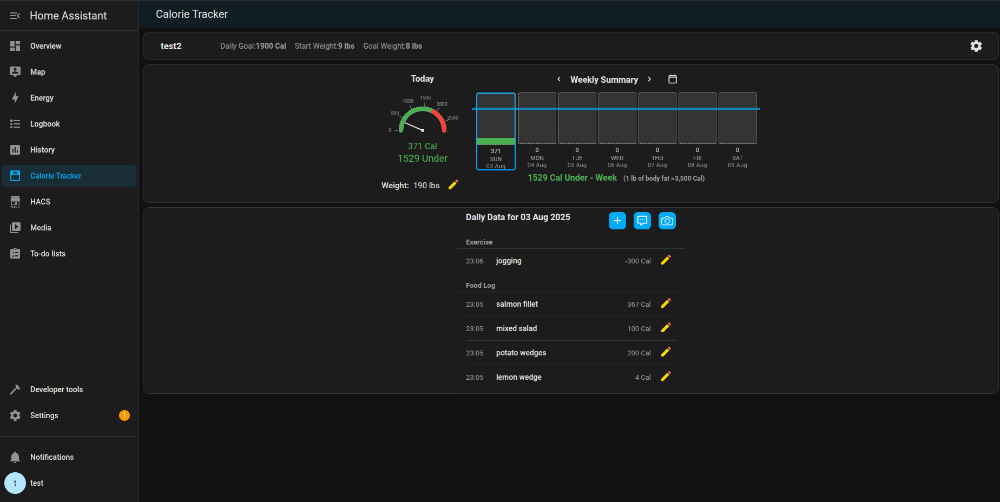
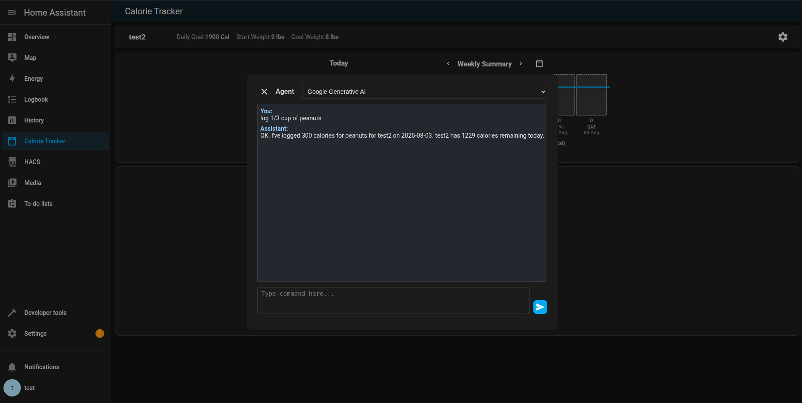

# Home Assistant Calorie Tracker

[](https://hacs.xyz/)

A [HACS](https://www.hacs.xyz/) integration that helps you monitor your daily calorie intake and progress toward your fitness goals. If using an LLM conversation agent (such as OpenAI Conversation), you can log everything through your voice assistant. A custom panel is included for visualizing your progress. 

## Features

- Tracks calories, exercises, and daily weight.
- Set your starting weight, goal weight, and daily calorie goals.
- Includes a Home Assistant side panel to view/edit all data.
- Supports multiple profiles for different users.
- With an LLM conversation agent (such as OpenAI Conversation) you can:
    - Log calories, exercise, and weight with your voice assistant
    - The LLM can also estimate calories from descriptions (better datails for better estimate)
- A service call is available to log calories.

## Install with HACS

The recommended way to download this is via HACS:


[](https://my.home-assistant.io/redirect/hacs_repository/?category=custom_respository&owner=kgstorm&repository=home-assistant-calorie-tracker)

Restart Home Assistant.

Add the Calorie Tracker integration via the Home Assistant Settings > Integrations.

## Manual Installation

1. Clone or download this repository into your Home Assistant `custom_components` directory:
   ```bash
   git clone https://github.com/kgstorm/home-assistant-calorie-tracker.git
   ```
   
Ensure the folder structure looks like this:
   ```yaml
    custom_components/
        calorie_tracker/
            __init__.py
            api.py
            const.py
            storage.py
            websockets.py
            ...
   ```
Restart Home Assistant.

Add the Calorie Tracker integration via the Home Assistant Settings > Integrations.

## Screenshots

### Calorie Tracker Panel
Entries can be viewed/made/edited/deleted in the Calorie Tracker panel:




### LLM Example



Development
Contributions are welcome. Please open an issue or submit a pull request if you'd like to improve the component.
